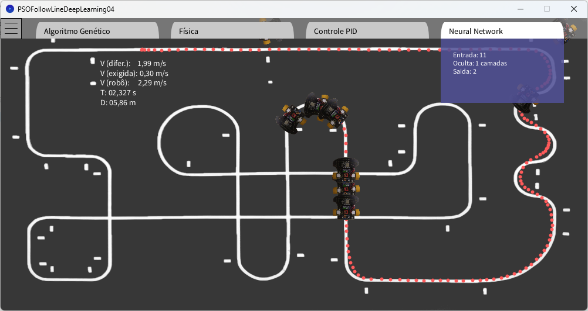

# PSO Follow Line Deep Learning Simulator

Simulador em Processing de um robô diferencial seguidor de linha com controle tradicional (PID), aprendizado de máquina (redes neurais recorrentes) e otimização de pesos via PSO (Particle Swarm Optimization). Inclui um modelo físico simplificado do robô, sensores virtuais e uma interface interativa para visualização e ajuste de parâmetros.



### Principais recursos
- Robô diferencial com modelo de dinâmica e cinemática
- Odometria e sensores frontais/laterais virtuais para leitura da linha
- Controle PID e controle por Rede Neural Recorrente (RNN)
- Otimização de pesos da rede por PSO executando em tempo de simulação
- Interface de menu para ajustar parâmetros de evolução e visualizar informações
- Registro opcional de dados de simulação em arquivos `.txt`

---

## Requisitos
- Processing 4 (Java Mode)
- Biblioteca Sound do Processing (utilizada para feedback sonoro)
  - Instale em: Sketch > Import Library… > Add Library… > pesquise por “Sound” e instale “Sound” (Processing Foundation)

Arquivos de mídia (imagens) já estão na pasta `data/` do projeto.

## Como executar
1. Instale o Processing 4 e a biblioteca Sound (ver acima).
2. Abra o projeto no Processing: File > Open… e selecione o diretório deste repositório (os arquivos `.pde` serão carregados como abas).
3. Certifique-se de que os arquivos de imagem existem em `data/`:
   - `data/Iron Cup 2019.png`
   - `data/Ratão 4.0.png`
4. Rode o sketch (tecla Play ou Ctrl/Cmd + R). O arquivo principal é `PSOFollowLineDeepLearning04.pde`.

Opcional (linha de comando): se possuir `processing-java` instalado, você pode executar:
```bash
processing-java --sketch="/caminho/para/este/projeto" --run
```

## Controles durante a simulação
- Teclado:
  - `S` / `N`: liga/desliga som
  - `A` / `D`: alterna exibição da trilha (atualização do desenho)
  - `M` / `U`: mostra/oculta múltiplos robôs “fantasmas” (comparação visual)
  - `I` / `O`: abre interface de PID (texto informativo)
  - `C`: alterna exibição de um círculo guia sob o mouse
- Mouse:
  - Clique com botão direito: reposiciona o robô (centro)
  - Barra superior: clique para abrir o menu; passe o mouse sobre as abas para exibir conteúdo; em algumas abas é possível arrastar barras deslizantes para ajustar parâmetros

## Menu e parâmetros
O menu no topo possui abas:
- Algoritmo Genético/PSO: mostra e permite ajustar parâmetros de evolução
  - Tamanho da população, taxa de mutação e pesos da função de fitness (estabilidade, velocidade, distância)
- Física: exibe parâmetros físicos (massa, momento de inércia, gravidade)
- Controle PID: mostra os ganhos atuais da malha externa
- Neural Network: mostra o tamanho de entrada/oculta/saída da rede

Observações:
- A evolução por PSO ocorre em uma thread (`trainNet`) durante a execução e atualiza os melhores pesos periodicamente.
- Métricas como “geração”, “fitness” etc. são impressas no console do Processing e exibidas no menu.

## Configurações rápidas (no código)
Os principais pontos configuráveis estão no `setup()` de `PSOFollowLineDeepLearning04.pde`:
- Ganhos iniciais de PID: `m[0].setPID(200, 0, 8)`
- Malhas externas (controladores usados pelo seguidor com controle de velocidade angular):
  - `m[0].malha_ext_esq = new Control(200, 0, 8);`
  - `m[0].malha_ext_dir = new Control(200, 0, 8);`
- Rede neural (tamanhos):
  - `int[] deepLearning = {11, 5, 2}; // entrada, ocultas, saída`
  - `int[] temporalLayers = {2, 0, 0}; // camadas temporais para RNN`
- Dinâmica/tempo:
  - `m[0].setVelMax(3.45);` (m/s)
  - `m[0].setVariacaoTempo(1000);` (µs por passo)

Parâmetros do algoritmo de evolução (classe `DNA` em `AI.pde`):
- `tamPopulacao` (tamanho da população), `mutacao` (taxa), pesos de fitness (`pesoVel`, `pesoDist`, `pesoEstabilidade`), limites de tempo e distância.

## Estrutura do projeto (arquivos principais)
- `PSOFollowLineDeepLearning04.pde`: sketch principal; carrega pista, inicializa robô, rede, PSO e loop de simulação
- `AI.pde` (classe `DNA`): avaliação de população, cálculo de fitness e iteração do PSO sobre pesos da rede
- `Robot.pde` (classe `Movimento`): lógica do robô, leitura de linha, PID, controle neural, odometria, dinâmicas de roda
- `Dynamic.pde`: dinâmica do robô (física simplificada), velocidades e integração
- `Deep_Learning.pde`: implementação de `Neural_Network` e operações de matriz auxiliares
- `Algebra.pde`: utilitários de matriz/vetores
- `Heuristic.pde`: implementação do PSO (população, indivíduos, atualização de poses)
- `Interface.pde`: menu superior, abas e barras deslizantes
- `Controles.pde`: classe `Control` (parâmetros/estado de controladores) e logs
- `Botoes.pde`: componentes de botão/área clicável usados pelo menu
- `data/`: recursos estáticos (imagens) usados pelo sketch
- `controle/`: logs opcionais exportados (velocidades, distância, tempo), quando habilitados

## Logs e exportação
Quando habilitado (ver `Control.save_data`), o simulador salva séries temporais em `controle/`:
- `vel_linear.txt`, `vel_estrategia.txt`, `dist_percorrida.txt`, `tempo.txt`

## Dicas
- Se a janela não abrir ou o som falhar, verifique se a biblioteca “Sound” está instalada no Processing 4.
- Para acelerar a simulação, ajuste `velTempo` em `PSOFollowLineDeepLearning04.pde`.
- Se o robô “sumir” da pista (sair da imagem), reposicione com o botão direito do mouse.

## Licença
Distribuído sob a licença MIT. Consulte o arquivo `LICENSE` para mais detalhes.

## Créditos
Autor: Jakson Almeida

